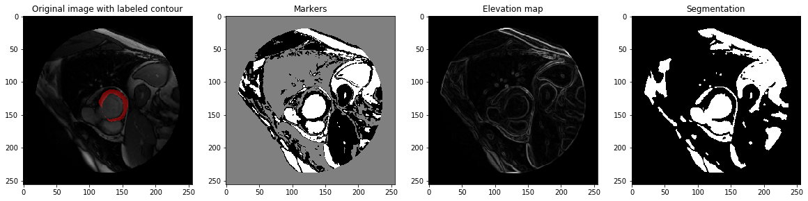

# Phase 1

- `pipeline.py` is the starting point of the program. 
- for unittests run 
```bash
python -m unittest 
```
- if data file structure is different than the intital provided data, modify path_settings.py according to data folder 
  structure that is being used

## Some assumptions:
 - The data file structure is fixed and could not be modified during the task. For use in a production database, 
  `path_settings.py` should be modified.

## Questions - Part 1:

1. I implemented unittests to check for the expected output of the given functions. For **parse_dicom()** and **parse_contour()** I wrote independant testcases while I could only verify the polygon_to_mask function as part of the wrapper **generate_input_target_arrays()**. I also tested the validity of some masks by visualizing them in a matplotlib plot. It seemed to make sense, as I expected an inner contour to be a filled round shape, which differs in size across the slices. Some example plots to quickly scan through can be viewed in the plots folder. 

2. In the intial code there was an import of 'dicom' which I assumed to be referring to the pydicom module. In the first function there was no check for potentially missing input files, so I added a try and except block. Additionally, I added more functions to wrap the given ones and map dicoms with their respective contour files. 


## Questions - Part 2:

1. I built a data generator which handles the looping over the dataset and random sampling. In the first part, the pipeline only supplied the processed dataset as a whole.
As [Keras] (https://keras.io/) uses these types of generators to feed data into their network, I built a similar data structure for further usage. I put it in a seperate class and wrapped Part 1 of generating the inputs and targets and Part 2 of creating a generator from the data in the main function **pipe_data()**. This generator has a fixed batch size, a fixed dataset size, which yields the amount of iterations it has to do for one epoch and samples the instances which are loaded per batch randomly. The indices for the chosen data samples are shuffled at the beginning and end of every epoch. 

2. I built unittests throughout development to incrementally built on working/tested functions. As I was already validating the creation of the inputs and targets in Part 1, I now focused on validating the generator. I tested the correct data types of the outputs and the variable batch size. It is rather hard to check the randomness of the generator and whether it covers every instance in one epoch as it has an infinite length and the only output is the data itself. I found a rather hacky solution by modifying the generator to output the indices of the data along with the arrays and checking the uniqueness of the indices per epoch in a hashtable. This validated, that each instance was outputted at least once. For the randomness criteria, I outputted the indices themselves to verify the randomness, but found, that the indices were not in a random order,despite calling np.random.shuffle() in the generator. Unfortunately, I found this bug too late and did not have enough time to fix it. I would assume that it comes from the fact, that the on_epoch_end() method of the generator only makes sense within the keras framework which triggers an on_epoch_end(). In further steps I would built the shuffling of indices into the generator without relying on this method.

3. Right now the pipeline first processes the entire dataset and then feeds it into the generator as a whole. That is problematic as the dataset size increases. I built in a function to store the data to disk after the first step which was not needed for a small dataset like this, but could be useful, when the dataset does not fit into memory anymore. Then I would have to make some adjustments to call the save_to_disk() function more often and adjust the generator to read the dataset from disk instead of passing it in as whole. A improvement would be to build the pipeline in real-time so that no data has to be stored. The preprocessing done in Part 1 would then be part integrated into the generator, which parses the dicoms and images as it calls the next batch of data. 


# Phase 2
## Questions Part 1:


1. Adding the o-contours was rather simple, as the code from the i-contours could mostly be reused. 
As in Phase 1, first the mapping between available dicoms and contours had to be computed. 
The function **map_dicom_contour()** of `PatientClass.py` could be called for both types of contours. Then I added a function **combine_mappings()** which computes the intersection of the available contours and a wrapper **map_dicom_contour_wrapper()** which handles the calling of these functions in the correct order.  
As in Phase 1, this mapping is used in **parsing.generate_input_target_arrays()** where I only had to add additional calls to **parse_contour_file()** and **poly_to_mask()** to generate the 
mask for the o-contours as well. The generated input and target arrays were then changed to a triplet format which was similarly adjusted in `DataGeneratorClass.py`.


## Questions Part 2: 

Please refer to `DataAnalysis.ipynb` for more details and visualizations.
1. First I tried to get an overview of the data by plotting the heart muscle as implied by the contouring. This showed that the contours were largely off in some cases, as the blood pool was not fully inside the o-contours which does not make sense. By counting the numbers of pixels from i-contours that were outside of the o-contour I found out, that the labeling was mostly okay for all patients except for patient 'SCD0000501'. 

In order to use a simple thresholding scheme to automatically create the i-contours from the o-contours, there should be a significant difference in pixel intensities between the muscle and the blood pool. The overall histogram plot of intensities shows that there is a large  overlap indicating that there cannot be just one global threshold. 
(./plots/Phase2_plots/grayscale_overall.png)

To visualize this intensity differences in the individual images I plotted the grayscale histograms comparing the distributions of the contour types. Again, there is mostly a large overlap implying misclassification errors. The objective is to keep these errors to the minimum. 

(./plots/Phase2_plots/example_grayscale_distribution2.png)

(./plots/Phase2_plots/example_grayscale_distribution4.png)

Instead, I applied [Scikit's implementation of the Otsu's method] (https://www.scipy-lectures.org/packages/scikit-image/index.html#binary-segmentation-foreground-background) for finding a threshold for binary segmentation of the image. Otsu's method searches for the threshold that minimizes the intra-class variance of the foreground and background. Since in this case I was given the o-contours and want to retrieve only the i-contours, it is possible to consider merely the inside of the o-contours and not the full image. Therefore, I tried Otsu's method on the intensities of the entire image and on the pixel data within the o-contours only. I plotted the histogram with both thresholds and the outcome of using these thresholds to segment the image into foreground and background. Evidently, the plots show better results for the second threshold based only on the partial pixel intensities. 
(./plots/Phase2_plots/otsu_segmentation2.png)


I consider thresholding a valueable approach for this scenario, as there are more methods for finding a threshold which could improve the results.

2. Another heuristic would be a region-based approach. Again, since I was given the o-contours, the i-contours will be inside this outline which could potentially be useful to grow regions from the inside out. This approach requires markers that indicate a definite assignment of pixels to blood pool or heart muscle. These markers should be extreme values such as the bimodal tops in the intensity histograms. However, this information is not available in this scenario. I initially tried to use central pixels within the o-contour as markers, but that did not work well. Instead, I chose global values roughly estimated from looking at the previous approach. I used Scikit's implementation of the watershed method, which "floods" areas of similar pixel intensities. The results did not look too bad. 
In order to use the watershed algorithm you have to generate an elevation map using an edge detection operator (such as Sobel). The results show,that the choice of the markers and the quality of the elevation map are critical.




3. For a Deep Learning approach to solve this problem, labeled data is needed. 